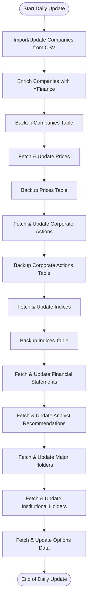

# Stock Market Data Pipeline

A robust, production-grade pipeline for ingesting, storing, and analyzing Indian stock market data using PostgreSQL, SQLAlchemy, and yfinance.

---

## 📑 Table of Contents
- [Overview](#overview)
- [Architecture](#architecture)
- [Data Sources & Coverage](#data-sources--coverage)
- [Prerequisites & Setup](#prerequisites--setup)
- [Database Schema](#database-schema)
- [Directory Structure](#directory-structure)
- [Usage](#usage)
  - [One-time Historical Import](#one-time-historical-import)
  - [Daily Updates](#daily-updates)
  - [Manual/Scripted Runs](#manualscripted-runs)
- [Logging & Monitoring](#logging--monitoring)
- [Data Quality & Validation](#data-quality--validation)
- [Troubleshooting & FAQ](#troubleshooting--faq)
- [Extending the Pipeline](#extending-the-pipeline)
- [Contributing](#contributing)
- [License & Support](#license--support)

---

## Overview

This project provides a scalable, modular, and highly automated solution for collecting, validating, and storing Indian stock market data. It is designed for:
- **Data analysts** and **quants** who need reliable, up-to-date market data
- **Developers** building dashboards, analytics, or trading systems
- **Researchers** requiring historical and real-time financial datasets

**Key Features:**
- End-to-end ingestion: companies, prices, corporate actions, indices, holders, financials, options, and more
- Batch processing, smart upserts, and duplicate prevention
- Timestamped, detailed logging for every run
- Data quality validation and error handling
- Modular scripts for both one-time and daily workflows
- Extensible for new data types and sources

---

## Architecture

```
┌───────────────┐    ┌───────────────┐    ┌───────────────┐
│ Screener CSV │    │  YFinance API │    │  PostgreSQL   │
│ (Companies)  │───▶│ (Prices,      │───▶│   Database    │
│              │    │  Actions, etc)│    │               │
└───────────────┘    └───────────────┘    └───────────────┘
         │                    │
         ▼                    ▼
   ┌───────────────┐   ┌───────────────┐
   │ Data Quality  │   │ Logging &     │
   │ Validation    │   │ Monitoring    │
   └───────────────┘   └───────────────┘
```

### High-Level Data Pipeline Flow

<!--
Note: The 'subgraph' feature in Mermaid diagrams may not render correctly on GitHub. Backup nodes are shown as direct outputs for compatibility.
-->
```mermaid
flowchart TD
    A[Screener CSV (Companies)] -->|Import/Enrich| B[Company Table]
    B -->|Fetch Prices| C[Prices Table]
    B -->|Fetch Corporate Actions| D[Corporate Actions Table]
    B -->|Fetch Financials| E[Financial Statements Table]
    B -->|Fetch Analyst Recommendations| F[Analyst Recommendations Table]
    B -->|Fetch Holders| G[Major/Institutional Holders Tables]
    B -->|Fetch Options| H[Options Data Table]
    I[Indices List] -->|Fetch Index Prices| J[Index Prices Table]
    B --> B1[Companies Backup]
    C --> C1[Prices Backup]
    D --> D1[Corporate Actions Backup]
    J --> J1[Index Prices Backup]
```
*Figure: End-to-end data flow from raw sources to database tables and backups.*

### Daily Update Script Flow


*Figure: Step-by-step flow of the daily update process, showing the order of script execution and backups.*

---

## Data Sources & Coverage
- **Screener.in**: Company fundamentals, financials, and metadata
- **Yahoo Finance**: Real-time and historical prices, corporate actions, indices, holders, options, analyst recommendations
- **PostgreSQL**: Centralized, indexed storage for all data

**Coverage:**
- All NSE/BSE listed companies (with valid codes)
- Major Indian and global indices
- 10+ years of historical data (where available)

---

## Prerequisites & Setup

### System Requirements
- Python 3.8+
- PostgreSQL 12+
- 4GB+ RAM, 10GB+ free disk space

### Python Dependencies
```bash
pip install -r requirements.txt
```

### Database Setup
```bash
sudo -u postgres createdb stockdb
sudo -u postgres createuser stockuser
sudo -u postgres psql -c "ALTER USER stockuser WITH PASSWORD 'stockpass';"
sudo -u postgres psql -c "GRANT ALL PRIVILEGES ON DATABASE stockdb TO stockuser;"
```

---

## Database Schema

**Core Tables:**
- `companies`: Company metadata and codes
- `prices`: Daily OHLCV data
- `corporate_actions`: Splits, dividends, etc.
- `indices`, `index_prices`: Index metadata and OHLCV
- `financial_statements`, `analyst_recommendations`, `major_holders`, `institutional_holders`, `options_data`: Extended market data

**Indexes:**
- Composite indexes on key columns for fast upserts and queries
- Unique constraints to prevent duplicates

*See `backend/models.py` for full schema details.*

---

## Directory Structure

```
stockmkt/
├── backend/                # SQLAlchemy models, DB config
├── data_ingestion/
│   ├── onetime/            # One-time import scripts
│   ├── *.py                # Daily ingestion scripts
│   └── backup_scripts/     # Data backup utilities
├── log/                    # Timestamped log files
├── migrations/             # Alembic DB migrations
├── run_*.sh                # Job runner scripts
└── requirements.txt        # Python dependencies
```

---

## Script Context & Responsibilities

Below is a summary of what each script does in this pipeline. This will help you understand the workflow and know which script to run for each task.

### Onetime Scripts (`data_ingestion/onetime/`)
| Script | Purpose |
|--------|---------|
| `1.1_import_screener_companies.py` | Import all companies from a Screener.in CSV export into the database. Used for full, one-time imports. |
| `1.2_add_yf_in_companies.py` | Fetch and update company metadata (profile, sector, industry, etc.) from Yahoo Finance for all companies. Used for full, one-time enrichment. |
| `1.3_onetime_backup_companies.py` | Create a timestamped backup of the companies table before major updates. |
| `2.1_onetime_prices.py` | Fetch and store all available historical daily price data for all companies using yfinance. Used for full, one-time import. |
| `2.2_onetime_backup_prices.py` | Create a timestamped backup of the prices table before major updates. |
| `3.1_onetime_corporate_actions.py` | Fetch and store all available historical corporate actions (splits, dividends) for all companies. Used for full, one-time import. |
| `3.3_onetime_backup_corporate_actions.py` | Create a timestamped backup of the corporate actions table before major updates. |
| `4.1_onetime_indices.py` | Fetch and store all available historical price data for major market indices. Used for one-time, full import. |
| `4.3_onetime_backup_indices.py` | Create a timestamped backup of the index prices table before major updates. |

### Daily Scripts (`data_ingestion/`)
| Script | Purpose |
|--------|---------|
| `1.1_import_screener_companies_daily.py` | Import only new companies (and update changed details) from the latest Screener.in CSV. Intended for daily use. |
| `1.2_add_yf_in_companies_daily.py` | Fetch and update company metadata from Yahoo Finance for all companies as part of the daily update. |
| `1.4_daily_backup_companies.py` | Create a daily backup of the companies table. |
| `2.3_daily_prices.py` | Fetch and store the latest available daily price data for all companies. |
| `2.4_daily_backup_prices.py` | Create a daily backup of the prices table. |
| `3.2_daily_corporate_actions.py` | Fetch and store the latest available corporate actions for all companies. |
| `3.4_daily_backup_corporate_actions.py` | Create a daily backup of the corporate actions table. |
| `4.2_daily_indices.py` | Fetch and store the latest available price data for major market indices. |
| `4.4_daily_backup_indices.py` | Create a daily backup of the index prices table. |
| `6.2_daily_financial_statements.py` | Fetch and store the latest available financial statements (income, balance, cashflow) for all companies. |
| `7.2_daily_analyst_recommendations.py` | Fetch and store the latest available analyst recommendations and ratings for all companies. |
| `8.2_daily_major_holders.py` | Fetch and store the latest available major shareholders/holders data for all companies. |
| `9.2_daily_institutional_holders.py` | Fetch and store the latest available institutional holders data for all companies. |
| `10.2_daily_options_data.py` | Fetch and store the latest available options data for all companies. |
| `backfill_last_modified.py` | Utility script to backfill or update the `last_modified` field in tables for data consistency. |

---

## Usage

### One-time Historical Import
Run all onetime scripts in sequence:
```bash
./run_historical_import.sh
```
Or step-by-step:
```bash
python3 data_ingestion/onetime/1.1_import_screener_companies.py data_ingestion/screener_export.csv
python3 data_ingestion/onetime/1.2_add_yf_in_companies.py
python3 data_ingestion/onetime/2.1_onetime_prices.py
python3 data_ingestion/onetime/3.1_onetime_corporate_actions.py
python3 data_ingestion/onetime/4.1_onetime_indices.py
```

### Daily Updates
Run all daily scripts:
```bash
./run_daily_updates.sh
```
Or run individual scripts as needed:
```bash
python3 data_ingestion/2.3_daily_prices.py
python3 data_ingestion/3.2_daily_corporate_actions.py
python3 data_ingestion/4.2_daily_indices.py
```

### Manual/Scripted Runs
- All scripts accept command-line arguments for custom runs (see script docstrings)
- Logs are written to `log/` with timestamps for every run

---

## Logging & Monitoring
- **All scripts** log to timestamped files in `log/`
- Both INFO and ERROR levels are captured
- Progress, errors, and summaries are always logged
- Use logs for debugging, monitoring, and audit trails

---

## Data Quality & Validation
- **Validation**: All data is validated for completeness, type, and range before insertion
- **Smart Upserts**: Only new or changed records are written to the DB
- **Duplicate Prevention**: Unique constraints and smart comparison logic
- **Data Quality Reports**: Summaries are logged after each run

---

## Troubleshooting & FAQ

### Common Issues
- **Numpy/PostgreSQL Errors**: All scripts convert numpy types to native Python types
- **Database Connection**: Ensure PostgreSQL is running and credentials are correct
- **Memory Issues**: For large imports, increase Python memory limit

### Example Commands
```bash
# Check DB connection
psql -U stockuser -d stockdb -c "SELECT 1;"

# Increase memory for large imports
export PYTHONOPTIMIZE=1
python3 -X maxsize=4G data_ingestion/onetime/2.1_onetime_prices.py
```

---

## Extending the Pipeline
- **Add new data types**: Create new SQLAlchemy models and ingestion scripts
- **Add new sources**: Integrate new APIs or CSVs as needed
- **Improve performance**: Parallelize yfinance fetches, tune batch sizes, or add caching
- **Automate further**: Add cron jobs, systemd services, or cloud automation

---

## Contributing

1. Fork the repository
2. Create a feature branch
3. Test your changes thoroughly
4. Submit a pull request with a clear description

---

## License & Support

This project is licensed under the MIT License.

**For support:**
- Check the troubleshooting section
- Review logs in `log/`
- Open an issue with detailed error information

---

*Built for reliability, extensibility, and data quality in financial analytics.* 