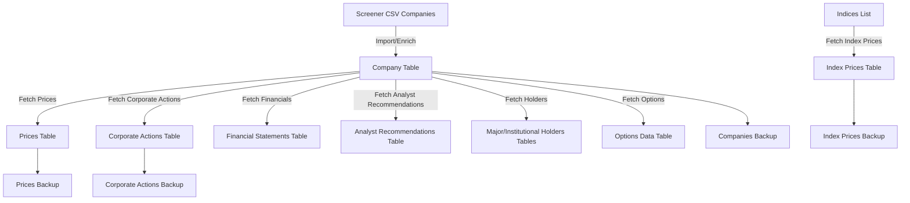

# Stock Market Data Pipeline

A robust, production-grade pipeline for ingesting, storing, and analyzing Indian stock market data using PostgreSQL, SQLAlchemy, and yfinance.

---

## 📑 Table of Contents
- [Overview](#overview)
- [Architecture](#architecture)
- [Data Sources & Coverage](#data-sources--coverage)
- [Prerequisites & Setup](#prerequisites--setup)
- [Database Schema](#database-schema)
- [Directory Structure](#directory-structure)
- [Usage](#usage)
  - [One-time Historical Import](#one-time-historical-import)
  - [Daily Updates](#daily-updates)
  - [Manual/Scripted Runs](#manualscripted-runs)
- [Logging & Monitoring](#logging--monitoring)
- [Data Quality & Validation](#data-quality--validation)
- [Troubleshooting & FAQ](#troubleshooting--faq)
- [Extending the Pipeline](#extending-the-pipeline)
- [Contributing](#contributing)
- [License & Support](#license--support)

---

## Overview

This project provides a scalable, modular, and highly automated solution for collecting, validating, and storing Indian stock market data. It is designed for:
- **Data analysts** and **quants** who need reliable, up-to-date market data
- **Developers** building dashboards, analytics, or trading systems
- **Researchers** requiring historical and real-time financial datasets

**Key Features:**
- End-to-end ingestion: companies, prices, corporate actions, indices, holders, financials, options, and more
- Batch processing, smart upserts, and duplicate prevention
- Timestamped, detailed logging for every run
- Data quality validation and error handling
- Modular scripts for both one-time and daily workflows
- Extensible for new data types and sources

---

## Architecture

```
┌───────────────┐    ┌───────────────┐    ┌───────────────┐
│ Screener CSV │    │  YFinance API │    │  PostgreSQL   │
│ (Companies)  │───▶│ (Prices,      │───▶│   Database    │
│              │    │  Actions, etc)│    │               │
└───────────────┘    └───────────────┘    └───────────────┘
         │                    │
         ▼                    ▼
   ┌───────────────┐   ┌───────────────┐
   │ Data Quality  │   │ Logging &     │
   │ Validation    │   │ Monitoring    │
   └───────────────┘   └───────────────┘
```

### High-Level Data Pipeline Flow

<!--
Note: Parentheses in node labels can break GitHub's Mermaid rendering. Use dashes or spaces instead.
-->

*Figure: End-to-end data flow from raw sources to database tables and backups.*

### Daily Update Script Flow


*Figure: Step-by-step flow of the daily update process, showing the order of script execution and backups.*

---

## Data Sources & Coverage
- **Screener.in**: Company fundamentals, financials, and metadata
- **Yahoo Finance**: Real-time and historical prices, corporate actions, indices, holders, options, analyst recommendations
- **PostgreSQL**: Centralized, indexed storage for all data

**Coverage:**
- All NSE/BSE listed companies (with valid codes)
- Major Indian and global indices
- 10+ years of historical data (where available)

---

## Prerequisites & Setup

### System Requirements
- Python 3.8+
- PostgreSQL 12+
- 4GB+ RAM, 10GB+ free disk space

### Python Dependencies
```bash
pip install -r requirements.txt
```

### Database Setup
```bash
sudo -u postgres createdb stockdb
sudo -u postgres createuser stockuser
sudo -u postgres psql -c "ALTER USER stockuser WITH PASSWORD 'stockpass';"
sudo -u postgres psql -c "GRANT ALL PRIVILEGES ON DATABASE stockdb TO stockuser;"
```

---

## Database Schema

**Core Tables:**
- `companies`: Company metadata and codes
- `prices`: Daily OHLCV data
- `corporate_actions`: Splits, dividends, etc.
- `indices`, `index_prices`: Index metadata and OHLCV
- `financial_statements`, `analyst_recommendations`, `major_holders`, `institutional_holders`, `options_data`: Extended market data

**Indexes:**
- Composite indexes on key columns for fast upserts and queries
- Unique constraints to prevent duplicates

*See `backend/models.py` for full schema details.*

---

## Directory Structure

```
stockmkt/
├── backend/                # SQLAlchemy models, DB config
├── data_ingestion/
│   ├── onetime/            # One-time import scripts
│   ├── *.py                # Daily ingestion scripts
│   └── backup_scripts/     # Data backup utilities
├── log/                    # Timestamped log files
├── migrations/             # Alembic DB migrations
├── run_*.sh                # Job runner scripts
└── requirements.txt        # Python dependencies
```

---

## Script Context & Responsibilities

Below is a summary of what each script does in this pipeline. This will help you understand the workflow and know which script to run for each task.

### Onetime Scripts (`data_ingestion/onetime/`)
| Script | Purpose |
|--------|---------|
| `1.1_import_screener_companies.py` | Import all companies from a Screener.in CSV export into the database. Used for full, one-time imports. |
| `1.2_add_yf_in_companies.py` | Fetch and update company metadata (profile, sector, industry, etc.) from Yahoo Finance for all companies. Used for full, one-time enrichment. |
| `1.3_onetime_backup_companies.py` | Create a timestamped backup of the companies table before major updates. |
| `2.1_onetime_prices.py` | Fetch and store all available historical daily price data for all companies using yfinance. Used for full, one-time import. |
| `2.2_onetime_backup_prices.py` | Create a timestamped backup of the prices table before major updates. |
| `3.1_onetime_corporate_actions.py` | Fetch and store all available historical corporate actions (splits, dividends) for all companies. Used for full, one-time import. |
| `3.3_onetime_backup_corporate_actions.py` | Create a timestamped backup of the corporate actions table before major updates. |
| `4.1_onetime_indices.py` | Fetch and store all available historical price data for major market indices. Used for one-time, full import. |
| `4.3_onetime_backup_indices.py` | Create a timestamped backup of the index prices table before major updates. |

### Daily Scripts (`data_ingestion/`)
| Script | Purpose |
|--------|---------|
| `1.1_import_screener_companies_daily.py` | Import only new companies (and update changed details) from the latest Screener.in CSV. Intended for daily use. |
| `1.2_add_yf_in_companies_daily.py` | Fetch and update company metadata from Yahoo Finance for all companies as part of the daily update. |
| `1.4_daily_backup_companies.py` | Create a daily backup of the companies table. |
| `2.3_daily_prices.py` | Fetch and store the latest available daily price data for all companies. |
| `2.4_daily_backup_prices.py` | Create a daily backup of the prices table. |
| `3.2_daily_corporate_actions.py` | Fetch and store the latest available corporate actions for all companies. |
| `3.4_daily_backup_corporate_actions.py` | Create a daily backup of the corporate actions table. |
| `4.2_daily_indices.py` | Fetch and store the latest available price data for major market indices. |
| `4.4_daily_backup_indices.py` | Create a daily backup of the index prices table. |
| `6.2_daily_financial_statements.py` | Fetch and store the latest available financial statements (income, balance, cashflow) for all companies. |
| `7.2_daily_analyst_recommendations.py` | Fetch and store the latest available analyst recommendations and ratings for all companies. |
| `8.2_daily_major_holders.py` | Fetch and store the latest available major shareholders/holders data for all companies. |
| `9.2_daily_institutional_holders.py` | Fetch and store the latest available institutional holders data for all companies. |
| `10.2_daily_options_data.py` | Fetch and store the latest available options data for all companies. |
| `backfill_last_modified.py` | Utility script to backfill or update the `last_modified` field in tables for data consistency. |

---

## Usage

### One-time Historical Import
Run all onetime scripts in sequence:
```bash
./run_historical_import.sh
```
Or step-by-step:
```bash
python3 data_ingestion/onetime/1.1_import_screener_companies.py data_ingestion/screener_export.csv
python3 data_ingestion/onetime/1.2_add_yf_in_companies.py
python3 data_ingestion/onetime/2.1_onetime_prices.py
python3 data_ingestion/onetime/3.1_onetime_corporate_actions.py
python3 data_ingestion/onetime/4.1_onetime_indices.py
```

### Daily Updates
Run all daily scripts:
```bash
./run_daily_updates.sh
```
Or run individual scripts as needed:
```bash
python3 data_ingestion/2.3_daily_prices.py
python3 data_ingestion/3.2_daily_corporate_actions.py
python3 data_ingestion/4.2_daily_indices.py
```

### Manual/Scripted Runs
- All scripts accept command-line arguments for custom runs (see script docstrings)
- Logs are written to `log/` with timestamps for every run

---

## Advanced Analytics & Power BI Integration

This project includes advanced R scripts for generating company-level insights, group metrics, and Power BI-ready outputs.

### Key Features
- **Group Metrics & Rankings:**
  - Calculates rankings and group averages for metrics such as return_on_equity, price_to_earning, eps, and debt_to_equity across multiple groupings (sector, industry, etc.).
  - For any row where the group field is blank or NA, ranking and average columns are set to `9999` for easy identification in Power BI.
- **Numeric Decile Labeling:**
  - Market capitalization deciles are labeled as `1` to `10` (not 'Decile 1', 'Decile 2', etc.) for easier numeric analysis.
- **Power BI-Friendly Outlier Columns:**
  - Outlier flags for key metrics are exported as `0` (not outlier) and `1` (outlier), with NA values set to `0`.
- **Timestamped Output Files:**
  - All output CSVs include a timestamp in the filename to prevent overwrites and aid in version tracking.

### Usage Instructions

1. **Run the R Insights Script:**
   - The main script is located at `data_ingestion/rscripts/2_companies_insights.R`.
   - Run it with:
     ```sh
     Rscript data_ingestion/rscripts/2_companies_insights.R
     ```
   - This will generate a CSV in the `output/` directory, e.g., `ranked_companies_all_groups_YYYYMMDD_HHMMSS.csv`.

2. **What the Output Contains:**
   - All original company data, plus:
     - Ranking columns for each metric and group (e.g., `return_on_equity_rank_by_sector_name_bse`)
     - Group average columns (e.g., `sector_name_bse_avg_return_on_equity`)
     - Outlier columns (`pe_outlier`, `roe_outlier`, `eps_outlier`, `debt_to_equity_outlier`) as 0/1
     - Decile column (`mcap_decile`) as 1–10
     - 9999 in ranking/average columns for rows with blank/NA group fields

3. **Power BI Integration:**
   - Import the latest output CSV into Power BI.
   - Use ranking and average columns for advanced visuals, benchmarking, and conditional formatting.
   - Filter or highlight rows with 9999 to identify companies with missing group data.
   - Use decile and outlier columns for segmentation and risk analysis.

4. **Customization:**
   - To add more metrics or groupings, edit the `metrics_to_average`, `metrics_to_rank`, and `ranking_group_fields` variables at the top of the R script.

---

## R Scripts: Data Analysis & Feature Engineering

The `data_ingestion/Rscripts` directory contains R scripts for data quality checks, feature engineering, and price analytics. These scripts are designed to be run after the main data ingestion steps and are essential for preparing data for analytics and Power BI dashboards.

### 0_setup_renv.R
- **Purpose:** Sets up the R environment using `renv` for reproducible package management.
- **Usage:**
  ```sh
  Rscript data_ingestion/Rscripts/0_setup_renv.R
  ```
- **When to run:** Once, or whenever you update R package dependencies.

### 1_dq_check_companies.R
- **Purpose:** Performs data quality checks on the `companies` table, including missing values, unique counts, and duplicate detection. Outputs a DQ summary CSV.
- **Usage:**
  ```sh
  Rscript data_ingestion/Rscripts/1_dq_check_companies.R
  ```
- **Output:** `output/dq_summary_companies_<timestamp>.csv`
- **When to run:** After initial data import or after major updates to company data.

### 2_companies_insights.R
- **Purpose:** Generates feature engineering, rankings, group averages, deciles, and outlier flags for all companies. Prepares data for Power BI and analytics.
- **Usage:**
  ```sh
  Rscript data_ingestion/Rscripts/2_companies_insights.R
  ```
- **Output:**
  - `output/ranked_companies_all_groups_<timestamp>.csv`
  - Updates the `companies_powerbi` table in PostgreSQL
- **When to run:** After updating company fundamentals or before Power BI refresh.

### 3_companies_prices_features.R
- **Purpose:** Calculates price-based features (returns, volatility, volume metrics, etc.) for all companies with price data. Joins features with company info for export.
- **Usage:**
  ```sh
  Rscript data_ingestion/Rscripts/3_companies_prices_features.R
  ```
- **Output:**
  - `output/companies_with_price_features_<timestamp>.csv`
  - `output/companies_with_price_features_matched_<timestamp>.csv`
- **When to run:** After updating price data or before analytics refresh.

### 4_price_volume_probabilities.R
- **Purpose:** Computes price and volume probability metrics for companies, useful for advanced analytics and risk modeling.
- **Usage:**
  ```sh
  Rscript data_ingestion/Rscripts/4_price_volume_probabilities.R
  ```
- **Output:**
  - `output/price_volume_probabilities_<timestamp>.csv`
- **When to run:** As needed for advanced analytics.

### debug_company_price_features.R
- **Purpose:** Debugging script for inspecting price features of a single company. Not for production use.
- **Usage:**
  ```sh
  Rscript data_ingestion/Rscripts/debug_company_price_features.R
  ```
- **Output:** Console output for inspection.
- **When to run:** For troubleshooting or development only.

---

## Logging & Monitoring
- **All scripts** log to timestamped files in `log/`
- Both INFO and ERROR levels are captured
- Progress, errors, and summaries are always logged
- Use logs for debugging, monitoring, and audit trails

---

## Data Quality & Validation
- **Validation**: All data is validated for completeness, type, and range before insertion
- **Smart Upserts**: Only new or changed records are written to the DB
- **Duplicate Prevention**: Unique constraints and smart comparison logic
- **Data Quality Reports**: Summaries are logged after each run

---

## Troubleshooting & FAQ

### Common Issues
- **Numpy/PostgreSQL Errors**: All scripts convert numpy types to native Python types
- **Database Connection**: Ensure PostgreSQL is running and credentials are correct
- **Memory Issues**: For large imports, increase Python memory limit

### Example Commands
```bash
# Check DB connection
psql -U stockuser -d stockdb -c "SELECT 1;"

# Increase memory for large imports
export PYTHONOPTIMIZE=1
python3 -X maxsize=4G data_ingestion/onetime/2.1_onetime_prices.py
```

---

## Extending the Pipeline
- **Add new data types**: Create new SQLAlchemy models and ingestion scripts
- **Add new sources**: Integrate new APIs or CSVs as needed
- **Improve performance**: Parallelize yfinance fetches, tune batch sizes, or add caching
- **Automate further**: Add cron jobs, systemd services, or cloud automation

---

## Contributing

1. Fork the repository
2. Create a feature branch
3. Test your changes thoroughly
4. Submit a pull request with a clear description

---

## License & Support

This project is licensed under the MIT License.

**For support:**
- Check the troubleshooting section
- Review logs in `log/`
- Open an issue with detailed error information

---

*Built for reliability, extensibility, and data quality in financial analytics.* 